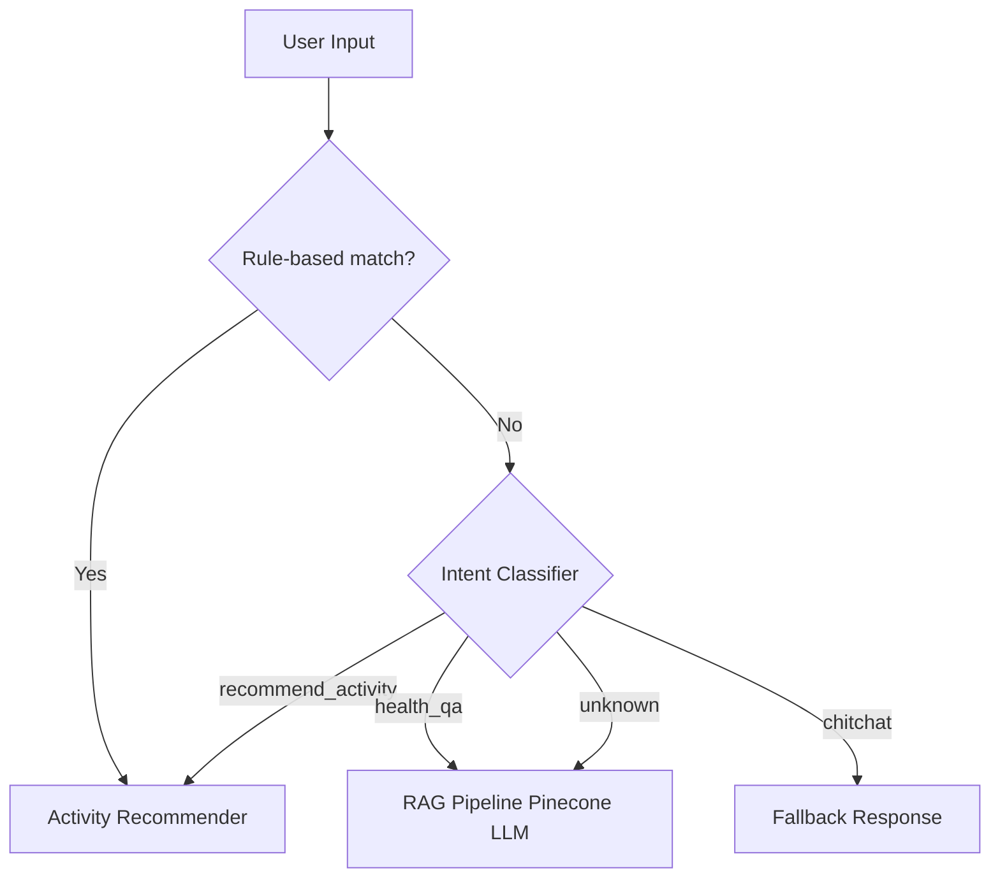

# Intelligent Care and Resource Matching Platform

## 📌 Overview
This project is a **health-focused chatbot system** that integrates:
- **Frontend:** Streamlit web interface (chat UI + vital signs input)
- **Backend:** FastAPI (REST API service)
- **RAG Pipeline:** Pinecone + OpenAI (or Doubao) for knowledge retrieval and Q&A
- **Recommendation Engine:** Suggests physical activities based on user input
- **Hybrid Intent Routing:** Rule-based triggers + ML-based intent classifier + fallback RAG

---

## ⚙️ Architecture
```
+-----------------+        +-------------------+
|   Streamlit UI  | <----> |   FastAPI Backend |
+-----------------+        +-------------------+
          |                          |
          v                          v
   Activity Recommender        RAG Knowledge Base (Pinecone + LLM)
          |                          |
          +------------> Hybrid Routing <------------+
```

### Hybrid Routing Logic
1. **Rule-based priority**: Explicit keywords like `recommend`, `activity`, `suggestion` → Activity recommender.  
2. **ML classifier** (`all-MiniLM-L6-v2` + Logistic Regression): Classifies input into  
   - `recommend_activity`
   - `health_qa`
   - `chitchat`
3. **Fallback**: If none of the above, send to RAG.

---

## 🧭 Intent Routing Flow



---

## 🚀 Getting Started

### 1. Clone the repository
```bash
git clone <your-repo-url>
cd IS Project
```

### 2. Environment variables
Create a `.env` file in the project root:
```env
OPENAI_API_KEY=your_api_key_here
PINECONE_API_KEY=your_pinecone_key_here
PINECONE_ENV=your_pinecone_env
```

### 3. Build and start services
```bash
docker compose up --build
```

- FastAPI backend → [http://localhost:8000/docs](http://localhost:8000/docs)  
- Streamlit frontend → [http://localhost:8501](http://localhost:8501)

---

### 4. Train intent classifier (first time only)
Before using the chatbot, train the classifier:

```bash
docker compose run --rm fastapi python backend/chatbot/train_intent.py
```

This will generate:

```
backend/chatbot/intent_clf.pkl
```

---

### 5. Build the RAG index (first time only)
If you add/update knowledge base documents (e.g., `elderly_health_qa.txt`), you must rebuild the index:

```bash
docker compose run --rm fastapi python backend/chatbot/build_index.py
```

This uploads embeddings to Pinecone and makes them available for retrieval.

---

### 6. Restart services after training
```bash
docker compose up
```

Now:
- The chatbot can classify intents using the trained classifier  
- The RAG pipeline can answer knowledge-base questions  

---

### 7. Access the UI
Open your browser → [http://localhost:8501](http://localhost:8501)

---

## 📂 Project Structure
```
.
├── backend/
│   ├── chatbot/
│   │   ├── rag_utils.py         # Pinecone + LLM setup
│   │   ├── rag.py               # RAG answer pipeline
│   │   ├── build_index.py       # Build Pinecone index from txt/pdf
│   │   ├── intent_classifier.py # ML-based intent classifier
│   │   └── chatbot_service.py   # Hybrid routing logic
│   ├── recommender.py           # Activity recommendation logic
│   ├── vital_signs_processor.py # Vital signs handling (optional)
│   └── main.py                  # FastAPI entrypoint
├── frontend/
│   └── streamlit_app.py         # Chat UI with chat-like bubbles
├── docker-compose.yml
├── Dockerfile
├── requirements.txt
└── README.md
```

---

## 📦 Dependencies
Key dependencies (see `requirements.txt` for full list):
- `fastapi`
- `uvicorn`
- `streamlit`
- `langchain`
- `langchain-openai`
- `langchain-pinecone`
- `pinecone-client`
- `sentence-transformers` (downloads **all-MiniLM-L6-v2** automatically)
- `scikit-learn`

### Note on `all-MiniLM-L6-v2`
- This model will be automatically downloaded from Hugging Face the first time you run the container.  
- To ensure smooth builds in Docker, you can pre-download it in `Dockerfile`:
```dockerfile
RUN python -c "from sentence_transformers import SentenceTransformer; SentenceTransformer('all-MiniLM-L6-v2')"
```

---

## 📊 Example Queries

- **Activity Recommendation**
  > "Can you recommend some activities?"  
  ✅ Routed to activity recommender

- **Health Q&A**
  > "What is the normal blood pressure for elderly?"  
  ✅ Routed to RAG (knowledge base)

- **Chitchat**
  > "Hello, how are you?"  
  ✅ Routed to fallback

---

## 🙌 Team Notes
- This project is designed for **course demo** purposes.  
- For production, we recommend replacing the simple classifier with a more robust intent detection model and securing `.env` secrets properly.
